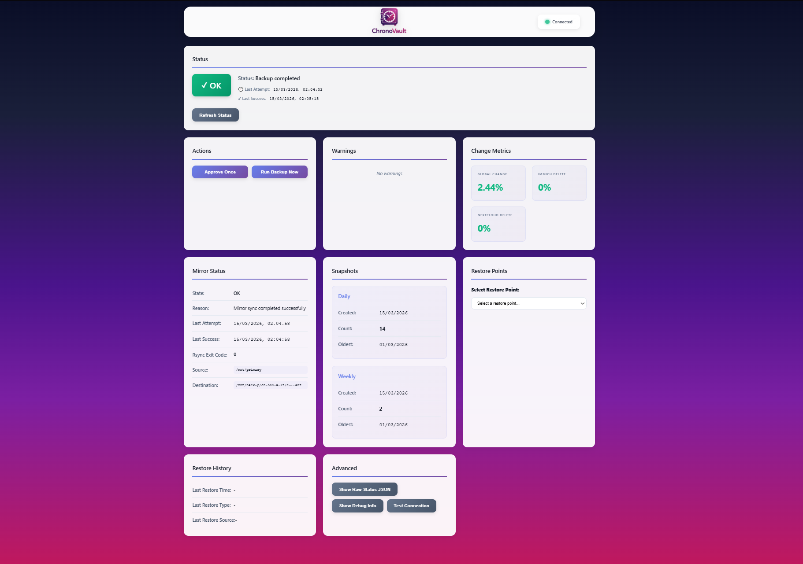
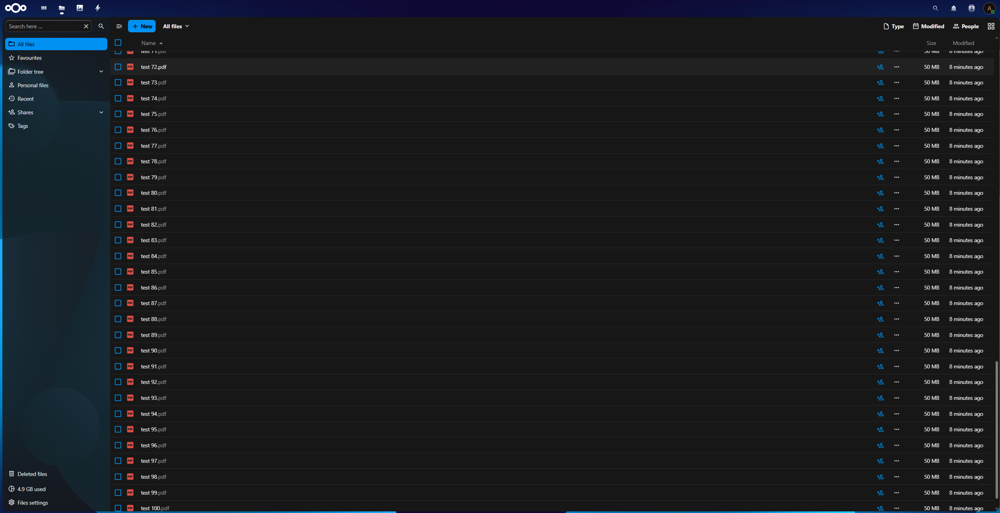
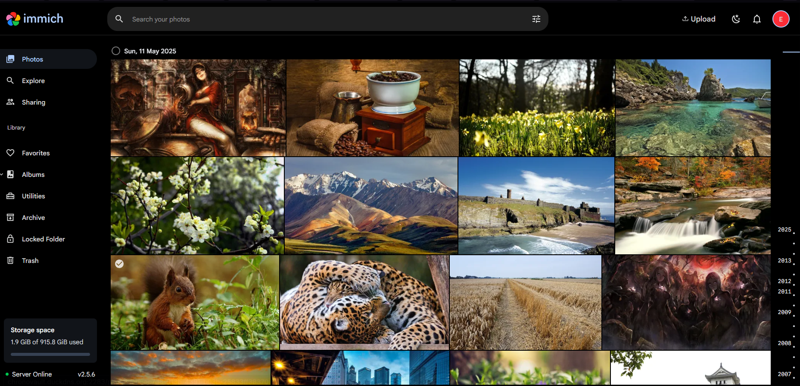

# ChronoVault

**Secure self-hosted photo and document server with snapshot recovery**

ChronoVault is a low-power, self-hosted storage platform for Raspberry Pi that provides private cloud storage with layered backup and recovery. It runs on a Raspberry Pi 4 and is designed for homelab and personal use. The system combines encrypted storage, containerized services, automated backups, and a control API into a resilient personal storage system capable of recovering deleted or corrupted data for weeks or months, depending on backup capacity.

Originally a personal project, ChronoVault has evolved into a **storage platform prototype** that demonstrates backup architecture, security design, system automation, and infrastructure engineering.

---

## Table of Contents

- [Key Features](#key-features)
- [Layered Data Recovery](#layered-data-recovery)
- [Encrypted Storage](#encrypted-storage)
- [Automated Backup System](#automated-backup-system)
- [Application Services](#application-services)
- [Secure Remote Access](#secure-remote-access)
- [Control System](#control-system)
- [Ransomware & Change Detection](#ransomware-and-abnormal-change-detection)
- [Email Notifications](#email-notification-system)
- [Automated Maintenance](#automated-maintenance)
- [Hardware Requirements](#hardware-requirements)
- [Storage Architecture](#storage-architecture)
- [Repository Structure](#repository-structure)
- [Installer](#chronovault-installer)
- [Backup & Restore Workflow](#backup-and-restore-workflow)
- [Skills Demonstrated](#engineering-skills-demonstrated)
- [Planned Improvements](#planned-improvements)
- [Screenshots](#screenshots)
- [3D Printed Case](#3d-printed-case)
- [License & Disclaimer](#license-and-disclaimer)

---

## Key Features

- **Layered recovery** — Application trash, daily snapshots (14), and weekly snapshots (12) for multiple restore points
- **LUKS encryption** — Primary and backup disks encrypted; backup disk mounted only during backup
- **Automated backups** — systemd timer at 02:00; rsync mirror + hard-link snapshots; DB dumps before sync
- **Containerized apps** — Immich (photos), Nextcloud (documents), DuckDNS, Twingate, Watchtower
- **Control API & UI** — Python/FastAPI dashboard for status, restore points, manual backup, and restore
- **Zero-trust remote access** — Twingate (no router port forwarding)
- **Ransomware protection** — Catastrophic-change detection freezes backups until manual approval
- **Email alerts** — SMTP notifications for backup failure, recovery, mirror errors, low space, service issues

---

## Layered Data Recovery

ChronoVault uses multiple recovery layers to protect against accidental deletion, corruption, or ransomware.

| Layer              | Typical duration | Purpose                          |
|--------------------|------------------|----------------------------------|
| Application trash  | Up to ~3 months  | Immediate recovery from mistakes |
| Daily snapshots    | 14 days          | Recent corruption recovery       |
| Weekly snapshots   | 12 weeks         | Longer-term recovery             |

Backups continue while files remain in application trash, so permanent deletion later still has snapshot coverage. Retention depends on **backup disk capacity**; large data churn can temporarily reduce how far back you can restore.

---

## Encrypted Storage

Both storage drives use **LUKS disk encryption**.

| Disk         | Behavior                                                                 |
|--------------|----------------------------------------------------------------------------|
| **Primary**  | Unlocked and mounted automatically at boot                                |
| **Backup**   | Locked by default; mounted **only during backup**, then unmounted and closed |

Keeping the backup disk offline during normal operation helps protect it from ransomware, accidental deletion, application bugs, and live filesystem corruption.

---

## Automated Backup System

Backups are driven by **systemd timers**.

| Schedule        | Time              |
|-----------------|-------------------|
| Daily backup    | 02:00 (America/New_York) |
| Weekly snapshot | Sunday 02:00 (same run; weekly snapshot created on Sunday) |

**Backup workflow**

1. Mount encrypted backup disk  
2. Create database dumps (Immich, Nextcloud)  
3. Sync files with **rsync** (mirror to `current/`)  
4. Create incremental snapshots using **hard links** (`--link-dest`)  
5. Apply retention (14 daily, 12 weekly)  
6. Unmount and lock backup disk  

**Snapshot layout**

```
/mnt/backup/chronovault/
├── current/           # Rolling mirror (latest state)
└── snapshots/
    ├── daily/        # 2025-01-15, 2025-01-16, … (14 kept)
    └── weekly/       # 2025-01-12, 2025-01-19, … (12 kept)
```

Snapshots use **hard-link deduplication**: only changed files use extra space.

---

## Application Services

Services run in **Docker containers**.

| Service    | Purpose                                  | Port / role   |
|------------|------------------------------------------|---------------|
| Immich     | Photo and video management               | 2283          |
| Nextcloud  | Documents and collaboration              | 8080          |
| Control UI | Status, restore points, backup & restore | 8787          |
| DuckDNS    | Dynamic hostname                         | internal      |
| Twingate   | Secure remote access                     | internal      |
| Watchtower | Automatic container image updates        | internal      |

Containers can be updated, restarted, or replaced independently.

---

## Secure Remote Access

ChronoVault **does not require router port forwarding**. Remote access uses **Twingate** (zero-trust networking).

```
User device
    → Twingate client
    → Twingate connector (container on ChronoVault host)
    → ChronoVault services (Immich, Nextcloud, Control UI)
```

Benefits: no open ports on the router, encrypted access, connectivity from any network.

**Dynamic hostname** — A DuckDNS container keeps a stable hostname (e.g. `chronovault.duckdns.org`) when the host’s IP changes. DNS resolution requires internet connectivity.

---

## Control System

ChronoVault includes a **control API and web UI** for day-to-day operations, available on **port 8787**.

- **Stack:** Python **FastAPI**, served by a systemd service (`chronovault-control.service`).  
- **Auth:** Token in query parameter; same token used for API and UI.

**Dashboard**

- System health and last backup time  
- Available restore points (daily/weekly)  
- Manual “Run backup now” and “Approve once” (after freeze)  
- Restore by snapshot date and app (Immich, Nextcloud, or both)  
- Warnings and alerts  

**Security**

- Firewall rules (e.g. control port allowed on LAN interface)  
- Token authentication; no default credentials  
- Least-privilege: control process runs as `chronovaultctl`; privileged actions via sudo  
- Optional: link from Nextcloud “External sites” for quick access  

**Current limitations (planned)**

- UI is HTTP (HTTPS planned)  
- Token is static (rotating tokens planned)  

---

## Ransomware and Abnormal Change Detection

Before each mirror sync, ChronoVault compares primary data to the current backup. If **more than 80% of stored data** would change in one run, it treats this as a possible abnormal event (e.g. ransomware or mass corruption).

When triggered:

1. Snapshot creation is **frozen**  
2. System state is set to **FROZEN**  
3. Backups do not run until the user **approves once** (UI or API)  
4. One backup runs; approval is consumed; normal operation resumes  

High deletion rates in Immich or Nextcloud (>10%) are also detected and reported as warnings (no freeze).

---

## Email Notification System

Health checks run every **5 minutes** (systemd timer). Alerts are sent via **SMTP** (e.g. Gmail with app password).

**Notifications include**

- Backup not OK (and recovery to OK)  
- Mirror/sync not OK (and recovery)  
- Storage usage ≥ 90% (primary or backup)  
- Control API service down  
- Backup timer disabled or inactive  

Rate limiting avoids spamming the same alert; persistent issues re-notify on a configurable interval (e.g. every 24 hours).

---

## Automated Maintenance

### Host (OS) updates

| Component | Detail |
|-----------|--------|
| Timer     | `chronovault-system-update.timer` |
| Schedule  | Sundays 04:00 (America/New_York), random delay up to 10 min |
| Script    | `chronovault-system-update.sh` (runs as root) |
| Actions   | `apt-get update`, `apt-get upgrade -y`, optional Docker package upgrade, `autoremove`, `autoclean` |
| Log       | `/var/log/chronovault/system-update.log` |

### Container updates

| Component | Detail |
|-----------|--------|
| Tool      | **Watchtower** (containerrr/watchtower) |
| Schedule  | Daily at 05:00 |
| Behavior  | Pull new images, recreate containers; cleanup old images; no volume removal |

| Layer      | Mechanism     | Schedule | What’s updated      |
|------------|---------------|----------|----------------------|
| Host OS    | systemd timer | Weekly   | System packages      |
| Docker     | apt upgrade   | Weekly   | docker.io / compose  |
| Containers | Watchtower    | Daily    | All service images   |

---

## Hardware Requirements

Optimized for low-power hardware.

| Component       | Recommendation              |
|----------------|-----------------------------|
| CPU            | Raspberry Pi 4 (4 GB)      |
| OS storage     | 64 GB high-endurance microSD |
| Primary data   | SATA SSD                    |
| Backup         | SATA SSD                    |
| Connectivity   | USB3–SATA adapter; external power for drives |

Also runs on Raspberry Pi 5, or other Debian-based systems.

---

## Storage Architecture

```
Primary disk (encrypted, mounted at boot)
├── apps/immich/upload, apps/nextcloud/data, …
└── backups/db/          # DB dumps created before each backup

Backup disk (encrypted, mounted only during backup)
└── chronovault/
    ├── current/         # rsync mirror
    ├── snapshots/daily/ # 14 dates
    ├── snapshots/weekly/ # 12 dates
    └── metadata/IDENTITY
```

**Retention:** 14 daily snapshots, 12 weekly snapshots (older ones pruned automatically).

---

## Repository Structure

```
chronovault/
├── docker/          # Compose templates (Immich, Nextcloud, DuckDNS, Twingate, Watchtower)
├── scripts/         # chronovault-backup-run, chronovault-restore, mount/umount, system-update
├── api/             # main.py (FastAPI), mailer.py, notify.py
├── ui/              # index.html, app.js, style.css, ui-config.js
├── installer/       # chronovault-installer.py + steps (18-step automated installer)
├── docs/            # Additional documentation (optional)
└── README.md
```

Compose files and env templates are generated or copied by the installer; secrets (tokens, passwords) are never stored in the repo.

---

## ChronoVault Installer

A **stateful, interactive installer** turns a fresh Raspberry Pi OS (or Debian-based) system into a full ChronoVault node.

**Run**

```bash
sudo python3 chronovault-installer.py
```

**What it does**

- **18 steps** in order: system check, packages, SSH, firewall, folders, disk selection, LUKS encryption, auto-unlock (with optional reboot), app dirs, Docker, DuckDNS, Immich, Twingate, Nextcloud, control API + UI, initial backup, email config, timers + Watchtower  
- **State file** (`/root/.chronovault-installer-state.json`): current step, completed steps, and config (disks, domains, etc.)  
- **Resume:** After a reboot or interrupt, re-run the script and continue from the last step  
- **Prompts only** for what’s needed (disks, LUKS passwords, DuckDNS token, Twingate tokens, SMTP, etc.)  
- **Final summary:** Control UI URL with token, app URLs, Twingate resource hints, key paths and commands  

No secrets or keys are stored in the repository; they are created on the host during install.

---

## Backup and Restore Workflow

### Backup (automated or manual)

```
Mount backup disk → Create DB dumps → Stop app containers → rsync mirror → Daily/weekly snapshots → Retention → Unmount backup disk
```

### Restore (UI, API, or CLI)

1. Select snapshot (daily or weekly by date).  
2. Stop application containers.  
3. Restore files from snapshot (rsync) for Immich and Nextcloud.  
4. Restore database from dump in snapshot; fix Nextcloud DB permissions if needed.  
5. Fix file ownership.  
6. Restart containers; run Nextcloud `occ` repair and file scan if applicable.  

Restore can be triggered from the **Control UI**, the **API** (`POST /action/restore`), or the **CLI** (`chronovault-restore <snapshot_path> [--apps immich|nextcloud]`).

---

## Engineering Skills Demonstrated

This project demonstrates:

- **Linux system administration** — systemd, LUKS, UFW, users/sudo  
- **Docker orchestration** — Compose, multi-service stack, networking  
- **Encrypted storage** — LUKS, key files, on-demand backup mount  
- **Backup architecture** — rsync, hard-link snapshots, retention, DB dumps  
- **Security design** — no backup port forwarding, offline backup disk, SSH hardening  
- **API development** — FastAPI, token auth, REST actions  
- **System automation** — timers, notifications, backup/restore flows  

---

## Planned Improvements

- HTTPS for the control UI  
- Rotating or short-lived authentication tokens  
- Improved deletion-detection alerts (e.g. email on high Immich/Nextcloud deletion %)  
- Enhanced ransomware/abnormality detection and reporting  
- Offline DNS fallback when DuckDNS is unreachable  
- Multi-user or role-based access for the control UI  
- Automatic handling of disk expansion (e.g. larger backup drive)  

---

## Screenshots

### Control dashboard

Status, backup/mirror health, change metrics, snapshots, restore points, and actions (Run Backup Now, Approve Once).



### Nextcloud (documents)

Document and file storage with folder tree, search, and sharing.



### Immich (photos)

Photo and video library with timeline, albums, and storage view.



*System architecture diagram to be added.*

---

## 3D Printed Case

A custom case was designed for ChronoVault hardware. STL files will be published on MakerWorld and linked here when available.

---

## License and Disclaimer

**License:** [MIT](LICENSE) (SPDX: `MIT`).

ChronoVault is a **prototype storage platform** intended for learning, experimentation, and homelab use. Review and adapt configurations and security settings before relying on it in production or for critical data.
